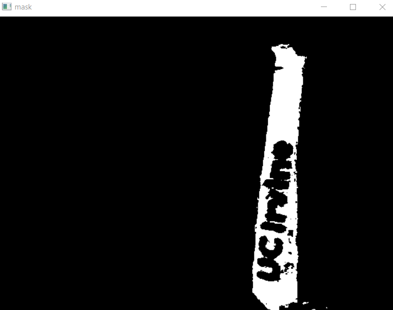
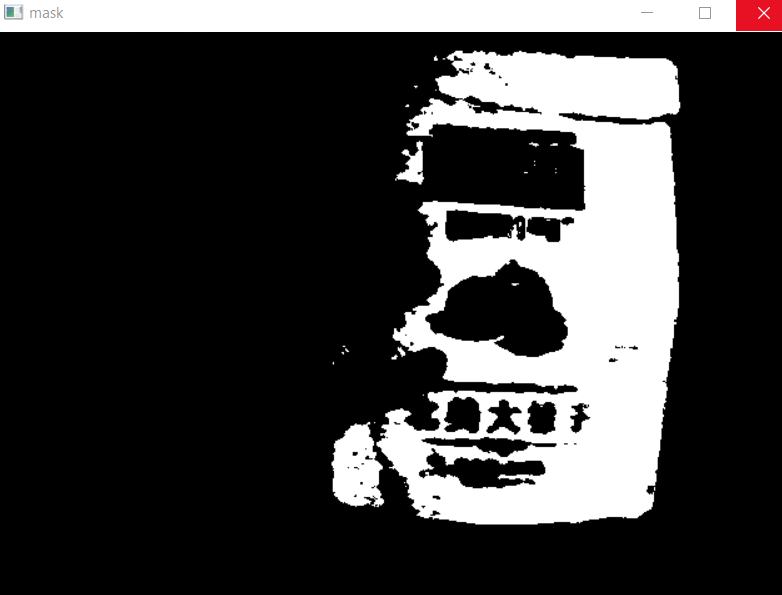
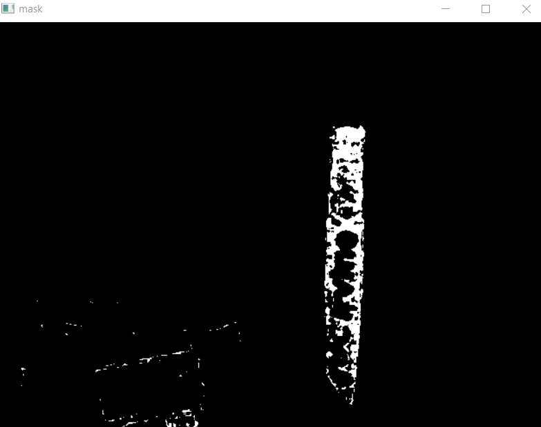
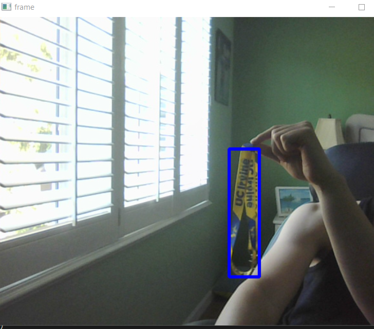
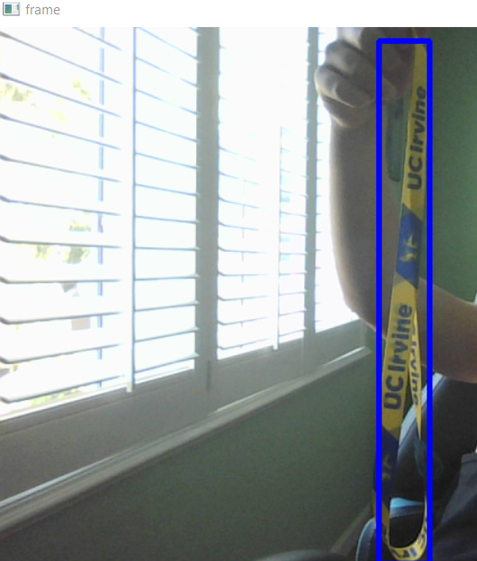

Testing the mask with color yellow [0, 255, 255] on a bright yellow-stripped lanyard. The mask filter was set to have a target zone of +-30.

Testing the same color mask on an orange/gold colored bag. It still detects it but not the text on it which is in dark blue.

The target area was tuned down to +-5 and this only picked up the lanyard and just barely the outline of the bag when placed together.

After using pillow to generate a bounding box, it's pretty cool to see the lanyard being detected in real time. Despite the lanyard having sections of blue, it was suprising how its able to still detect the full lanyard. 

