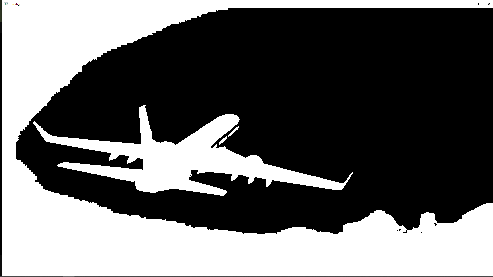
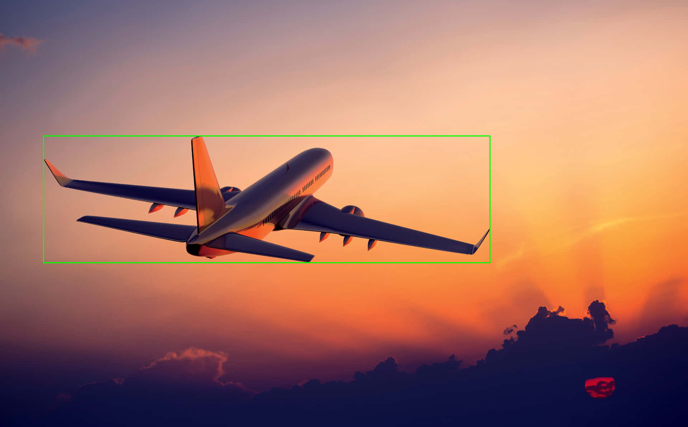

# CV-notes
Learning computer vision with OpenCV through small projects

Object detection - 

 

The goal is to detect the plane in the image above. Given the lighting, the clouds at the bottom have the same color/lighting as the plane which makes separate a bit difficult. 

 

The first step was to conver the image into a binary one through thresholding. The result was the plane and the clouds converted into white pixels while the background became black, which allows the contour function to plot the contour lines. 

Separating the plane from the clouds was a challenge, I played around with the threshold value so that the clouds was one giant blob. This allowed me to apply an upper-limit filter for the contour area to separate the plane:

